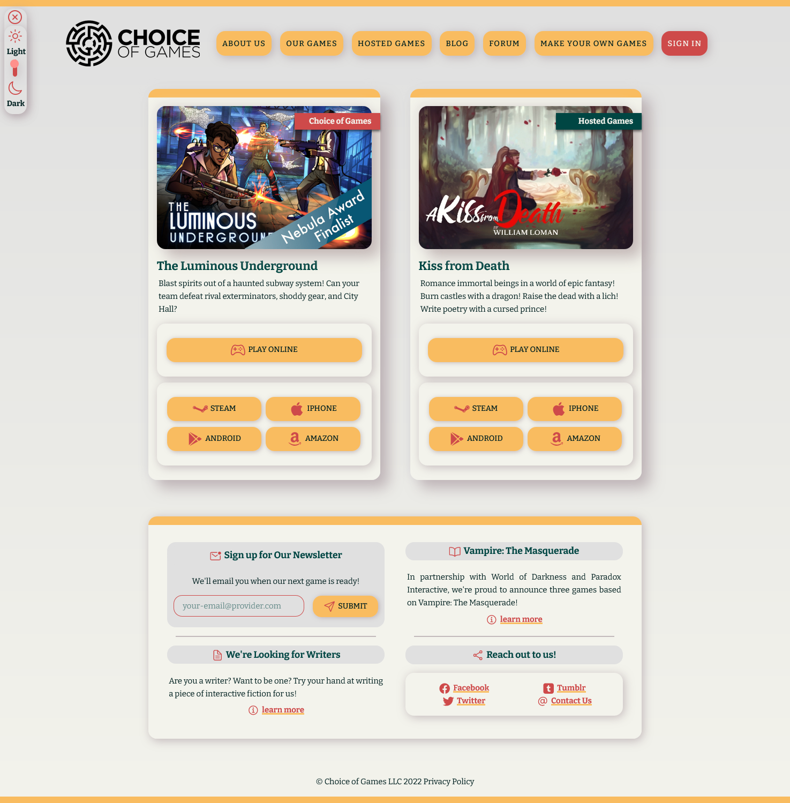
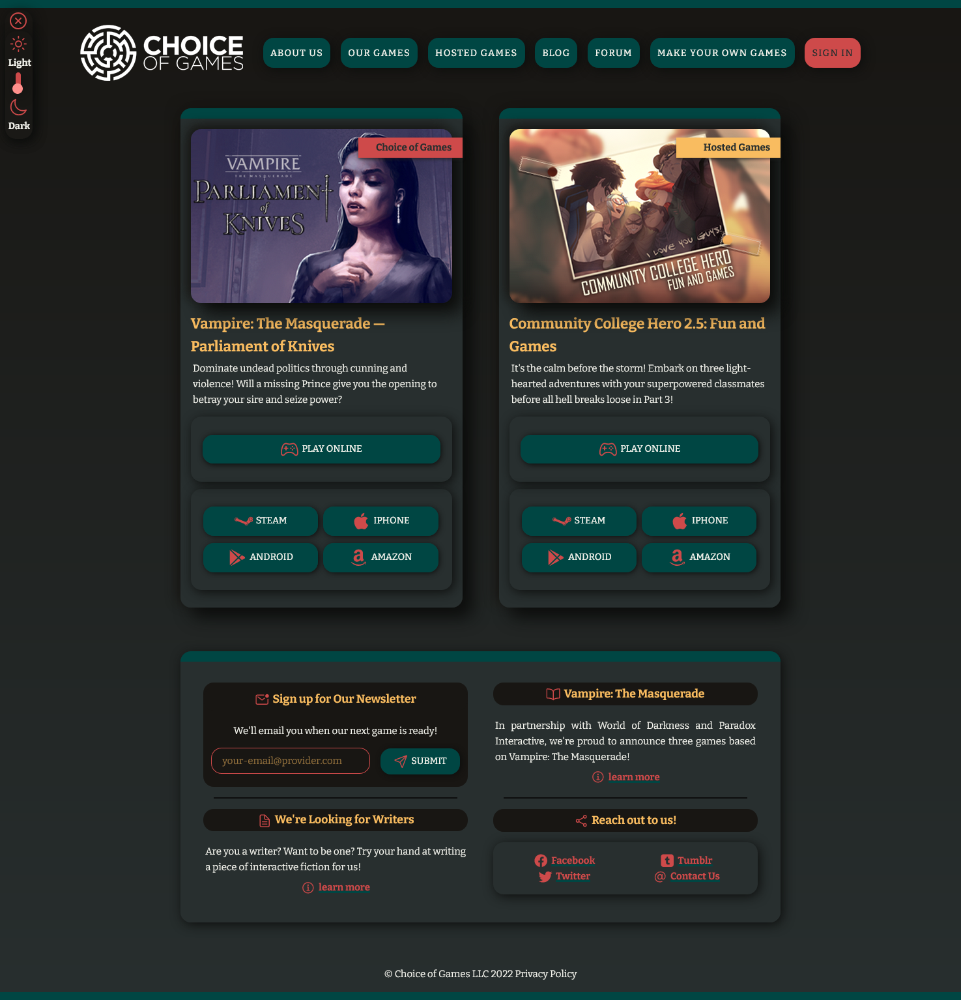

# Case Study: Choice of Games Website Redesign

I love Choice of Games, and it's a platform I usually use for finding cool new stories. For study, I decided to make a unofficial redesign for their website. 😊

**You can check their official website here: https://www.choiceofgames.com/**

> ⚠️ As a disclaimer, I do not own nor am I associated with Choice of Games in any way. This is just a study project!

> ✅ If you have any feedback, please don't hesitate to share it with me! I really do appreciate it.

---

## Overview

Here's some things I want to achieve:

- [x] add a functional **light/dark mode;**
- [x] use **setInterval()** to switch between their latest releases;
- [x] give more attention to their hosted games releases, using the same model as above;
- [x] use CSS GRID to make it responsive and modernize its overall appearance => specially in their Our Games / Hosted Games page, where they list all their released games.
- [ ] Refine pagination in the OurGames Page.
- [ ] Create an OBJ with the games info for the homepage, to make the JS code drier.
- [ ] Update screenshots.
- [ ] Polish the interface, the CSS and the JS.

I may add some extra features as I go, and/or revise some things as I get to learn more.

## Images

## Changelog

- 1.0 - Initial commit.
- 2.0 - Refined grids and OurGames page. Added Event Listeners.
- 3.0 - Refined the OurGames.js file, to make it drier.
- 3.5 - Added About Us page.
